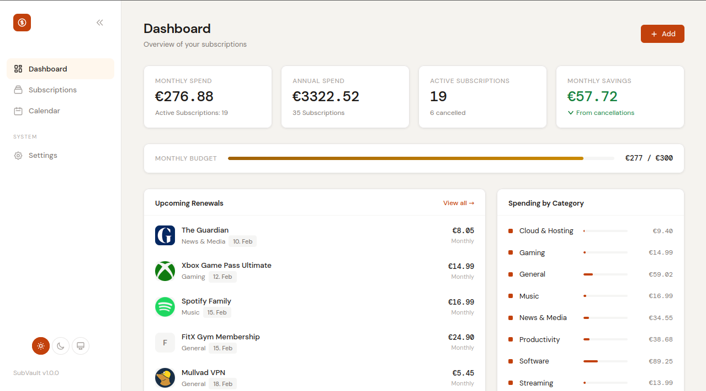
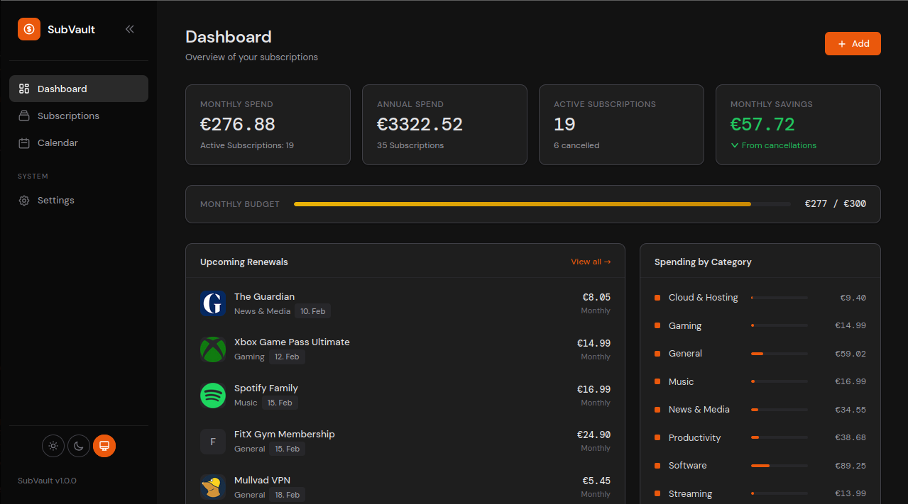
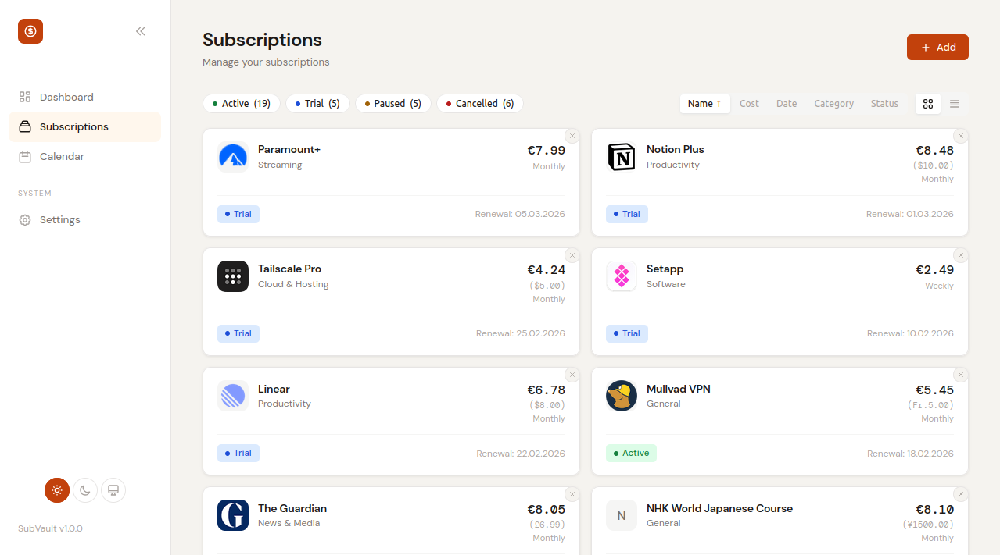
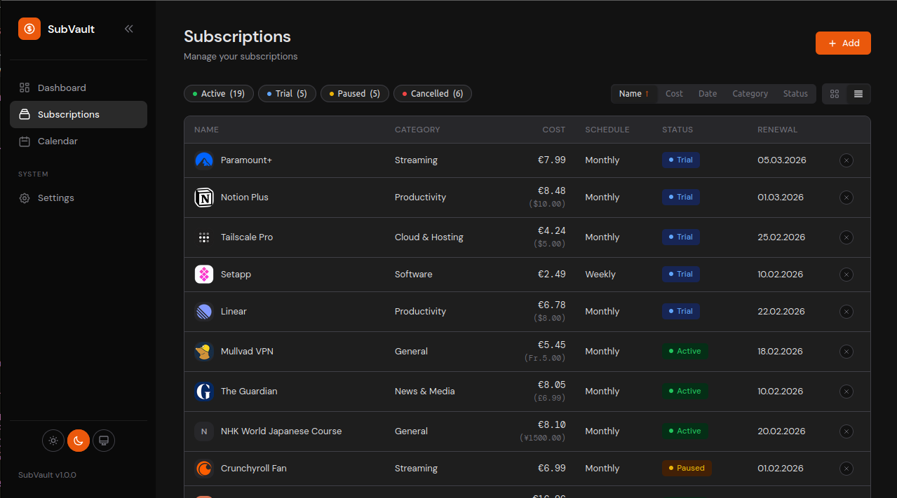
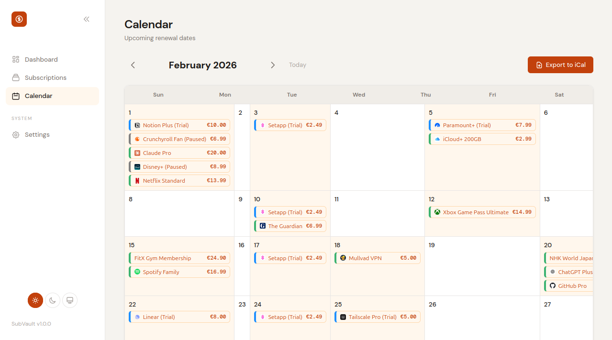
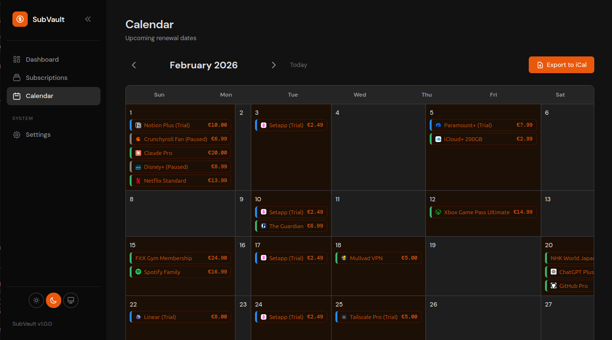
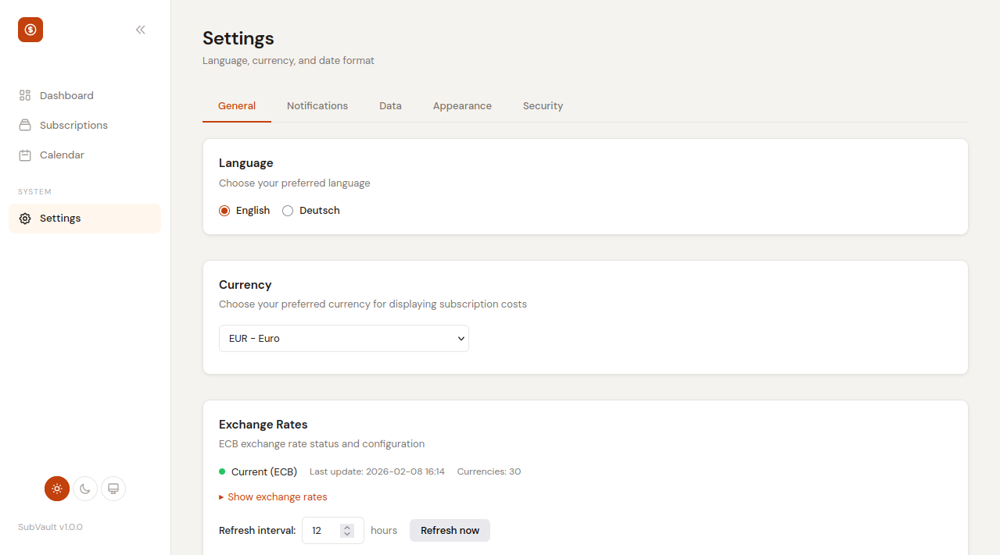
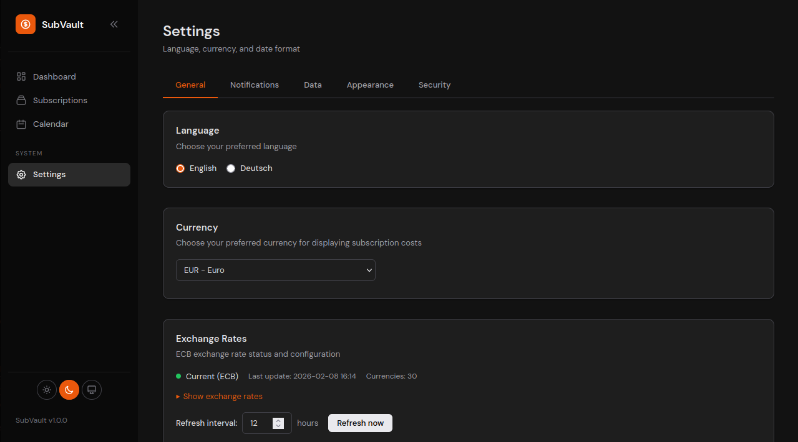

# SubVault

[](https://golang.org/)
[](LICENSE)
[](https://ghcr.io/yakgravity/subvault)
[](https://github.com/YakGravity/subvault/actions/workflows/test-build.yml)

A self-hosted subscription management application built with Go and HTMX. Track recurring expenses, visualize spending analytics, and get renewal reminders — all on your own server.

## Screenshots

<details open>
<summary>Dashboard</summary>



</details>

<details>
<summary>Subscriptions</summary>



</details>

<details>
<summary>Calendar</summary>



</details>

<details>
<summary>Settings</summary>



</details>

## Features

- **Dashboard** — Monthly/annual spending overview with category breakdown
- **Subscription Tracking** — Manage all recurring expenses with automatic logo fetching
- **Calendar View** — Visual renewal calendar with iCal export (RFC 7986 colors)
- **Analytics** — Spending trends by category, monthly projections, savings tracking
- **Notifications** — Email (SMTP) and push notifications via [Shoutrrr](https://containrrr.dev/shoutrrr/)
- **Multi-Currency** — 30+ currencies with automatic ECB exchange rates
- **12 Themes** — 6 color palettes with light/dark mode, accent colors, collapsible sidebar
- **Data Export** — CSV, JSON, iCal, and encrypted backup format
- **REST API** — Full CRUD API with key-based authentication
- **i18n** — English and German
- **Mobile Responsive** — Optimized for all screen sizes
- **Self-Hosted** — SQLite database, no external dependencies

## Quick Start

```yaml
# docker-compose.yml
services:
  subvault:
    image: ghcr.io/yakgravity/subvault:latest
    ports:
      - "8080:8080"
    volumes:
      - subvault_data:/app/data
    restart: unless-stopped

volumes:
  subvault_data:
```

```bash
docker compose up -d
```

Open [http://localhost:8080](http://localhost:8080) — no initial setup required.

## Documentation

| Topic | Description |
|-------|-------------|
| [Configuration](docs/configuration.md) | Environment variables, Docker setup, notifications, reverse proxy |
| [API](docs/api.md) | REST API endpoints, authentication, examples |
| [Development](docs/development.md) | Local setup, building, project structure, code style |
| [Migration](docs/migration.md) | Migrating from SubTrackr |

## Tech Stack

| Component | Technology |
|-----------|-----------|
| Backend | Go 1.24, Gin |
| Database | SQLite (via GORM) |
| Frontend | HTMX, custom CSS design system |
| Auth | Session-based + API keys, CSRF protection |
| i18n | go-i18n (English, German) |
| Container | Multi-arch Docker (amd64, arm64) |

## Attribution

SubVault is a fork of [SubTrackr](https://github.com/bscott/subtrackr) by [Brian Scott](https://github.com/bscott). This fork extends the original with multi-currency support, an extended theme system, internationalization, encrypted backups, push notifications, calendar integration, and a production-ready Docker setup.

## License

[GNU Affero General Public License v3.0 (AGPL-3.0)](LICENSE)
